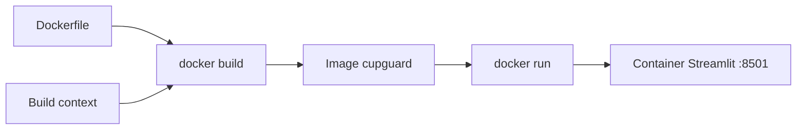

# Part B — Containerising CupGuard with Docker


In Part A you ran CupGuard locally with `uv` and a Conda environment. That works on your laptop — but production rarely looks like one developer's machine. Part B introduces **Docker**: a way to ship the same app, with the same Python version and libraries, to any server that runs containers.

---

## What is Docker?

Docker is a platform for building and running **containers**. A container is a lightweight, isolated process that bundles:

- your **application code**
- the **runtime** (e.g. Python 3.12)
- **system libraries** and **Python packages**

Everything runs inside a read-only **image** — a snapshot recipe that Docker can start as one or more containers.

### Why do we need it?

| Problem without Docker | How Docker helps |
|------------------------|------------------|
| *"It works on my machine"* — different OS, Python version, or missing packages | Same image runs the same way on laptop, CI, and cloud |
| Manual setup docs drift from reality | The `Dockerfile` **is** the setup documentation |
| Deploying means SSH + `pip install` on every server | Build once, push the image, run anywhere |
| Upgrades are risky — you overwrite a shared server environment | Each release is a new immutable image; roll back by running the previous tag |

In MLOps, Docker is the bridge between **training/serving code** and **production deployment**. CI builds the image; Kubernetes (or a cloud service) schedules containers from that image. You don't have to recreate your Conda env by hand.

### Core concepts

| Term | Meaning |
|------|---------|
| **Dockerfile** | Text file with step-by-step instructions to build an image |
| **Image** | Immutable template built from a Dockerfile (e.g. `cupguard:latest`) |
| **Container** | A running instance of an image |
| **Build context** | Files Docker can see during `docker build` (the `.` in the command) |
| **Registry** | Storage for images (Docker Hub, GitHub Container Registry, etc.) |



---

## Install Docker

Install **Docker Desktop** (includes the Docker Engine and CLI). After installation, open a terminal and verify:

```bash
docker --version
docker run hello-world
```

If `hello-world` prints a success message, Docker is ready.

### macOS

1. Download **Docker Desktop for Mac** from [https://docs.docker.com/desktop/setup/install/mac-install/](https://docs.docker.com/desktop/setup/install/mac-install/).
2. Open the `.dmg`, drag Docker to Applications, and launch **Docker Desktop**.
3. Wait until the whale icon in the menu bar shows **Docker Desktop is running**.
4. Apple Silicon (M1/M2/M3): use the **Apple Silicon** installer. Intel Macs: use the **Intel** installer.

### Linux (Ubuntu / Debian)

Follow the official engine install guide: [https://docs.docker.com/engine/install/ubuntu/](https://docs.docker.com/engine/install/ubuntu/).

Quick path (Ubuntu):

```bash
# Add Docker's official GPG key and repository, then install:
sudo apt-get update
sudo apt-get install -y ca-certificates curl
sudo install -m 0755 -d /etc/apt/keyrings
sudo curl -fsSL https://download.docker.com/linux/ubuntu/gpg -o /etc/apt/keyrings/docker.asc
sudo chmod a+r /etc/apt/keyrings/docker.asc

echo \
  "deb [arch=$(dpkg --print-architecture) signed-by=/etc/apt/keyrings/docker.asc] https://download.docker.com/linux/ubuntu \
  $(. /etc/os-release && echo "${VERSION_CODENAME:-$VERSION_ID}") stable" | \
  sudo tee /etc/apt/sources.list.d/docker.list > /dev/null

sudo apt-get update
sudo apt-get install -y docker-ce docker-ce-cli containerd.io docker-buildx-plugin docker-compose-plugin
```

Add your user to the `docker` group so you can run Docker without `sudo` (log out and back in afterward):

```bash
sudo usermod -aG docker $USER
```

### Windows

1. Install **Docker Desktop for Windows** from [https://docs.docker.com/desktop/setup/install/windows-install/](https://docs.docker.com/desktop/setup/install/windows-install/).
2. Enable **WSL 2** when prompted (recommended backend).
3. Restart if required, launch **Docker Desktop**, and wait until it reports **Engine running**.
4. Use **PowerShell** or **Windows Terminal** for the commands below.

---

## Build and run CupGuard

The Dockerfile lives in **Part-B**, but the **build context must be the `MLOps-Abha` root folder**. The Dockerfile copies files from both Part-A (dependencies) and Part-B (application code):

```dockerfile
COPY Part-A/pyproject.toml ./
COPY Part-B/cupguard/ ./cupguard/
```

If you run `docker build` from inside `Part-B`, those paths will not exist and the build will fail.

### 1. Open a terminal at the repo root

```bash
cd MLOps-Abha
```

Your working directory should contain `Part-A/`, `Part-B/`, and `README.md`.

### 2. Build the image

```bash
docker build -f Part-B/Dockerfile -t cupguard .
```

| Flag | Purpose |
|------|---------|
| `-f Part-B/Dockerfile` | Use the Dockerfile in Part-B |
| `-t cupguard` | Tag (name) the image `cupguard` |
| `.` | Build context = current directory (`MLOps-Abha`) |

The first build downloads the base Python image and installs dependencies — it may take a few minutes. Later builds reuse cached layers and are much faster.

### 3. Run a container

```bash
docker run --rm -p 8501:8501 cupguard
```

| Flag | Purpose |
|------|---------|
| `--rm` | Remove the container when it stops |
| `-p 8501:8501` | Map port 8501 on your machine to port 8501 inside the container |
| `cupguard` | Image to run |

Open [http://localhost:8501](http://localhost:8501) in your browser. You should see the **CupGuard — 2026 FIFA World Cup Match Predictor** Streamlit app.

Use the sidebar to run the full pipeline or pick teams for predictions — same behaviour as Part A, now inside a container.

### 4. Stop the container

Press **Ctrl+C** in the terminal where `docker run` is active. With `--rm`, the container is removed automatically.

---

## Walkthrough: the Dockerfile

```dockerfile
FROM python:3.12-slim          # Base OS + Python
WORKDIR /app
RUN pip install --no-cache-dir uv
COPY Part-A/pyproject.toml ./
RUN uv pip install --system --no-cache -r pyproject.toml
COPY Part-B/cupguard/ ./cupguard/
WORKDIR /app/cupguard/src
EXPOSE 8501
CMD ["streamlit", "run", "worldcup_agent_app.py", "--server.port", "8501", "--server.address", "0.0.0.0"]
```

Notes:

- **`python:3.12-slim`** — small Debian-based image with Python 3.12; matches the project's Python constraint.
- **`uv pip install --system`** — installs Part-A dependencies into the container (same packages as your local lab).
- **`--server.address 0.0.0.0`** — Streamlit listens on all interfaces so traffic from your host reaches the app through `-p 8501:8501`.
- **`EXPOSE 8501`** — documents the port; `-p` on `docker run` actually publishes it.

---

## Useful Docker commands

```bash
# List local images
docker images

# List running containers
docker ps

# List all containers (including stopped)
docker ps -a

# Rebuild after code changes (no cache)
docker build --no-cache -f Part-B/Dockerfile -t cupguard .

# Run in the background
docker run -d --name cupguard-app -p 8501:8501 cupguard

# View logs of a background container
docker logs cupguard-app

# Stop and remove a named container
docker stop cupguard-app && docker rm cupguard-app
```

---

## Troubleshooting

| Symptom | Likely cause | Fix |
|---------|--------------|-----|
| `COPY failed: file not found` | Build run from wrong directory | `cd` to `MLOps-Abha`, not `Part-B` |
| `Cannot connect to the Docker daemon` | Docker Desktop not running | Start Docker Desktop and wait until ready |
| `port is already allocated` | Something else on port 8501 (e.g. local Streamlit) | Stop the other process or use `-p 8502:8501` and open `localhost:8502` |

---

## Your task

| Step | Goal |
|------|------|
| **1** | Install Docker and confirm with `docker run hello-world` |
| **2** | Build the `cupguard` image from `MLOps-Abha` using `Part-B/Dockerfile` |
| **3** | Run the container and open the Streamlit UI at [http://localhost:8501](http://localhost:8501) |
| **4** | Change something small in `Part-B/cupguard/src/pipeline.py`, rebuild, and confirm the update appears in the browser |

---
