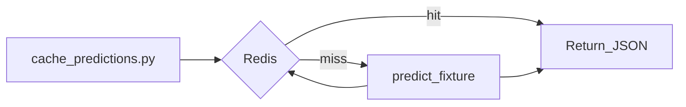

# Part D — Redis for ML serving

KAUST Academy

| **Focus** | Run Redis in Docker and cache CupGuard prediction results |
| **Builds on** | Part-B CupGuard serving (`predict_fixture`) |

Part-A and Part-B train and serve the CupGuard outcome model. Part-C containerises inference. Part-D adds a **cache layer** — a common production pattern when identical prediction requests arrive faster than you can reload a model and score features.

## Prerequisites

- Docker
- Python 3.11 with the CupGuard environment from Part-A/B (pandas, scikit-learn, etc.)
- Trained model at `Part-B/cupguard/models/outcome_model.pkl`

If the model file is missing, run the Part-B Streamlit app and use **Run full pipeline** in the sidebar.

---


## What is Redis?

Redis is an in-memory **key-value store**. Values are strings (often JSON); keys can expire after a TTL (time to live). Reads are sub-millisecond at scale. In ML systems Redis is usually a **cache** or **queue backend**, not the primary database.

### Redis in production ML


| Use case                           | Production role                                  | CupGuard example                                                                                 |
| ---------------------------------- | ------------------------------------------------ | ------------------------------------------------------------------------------------------------ |
| **Inference result cache**         | Skip repeated model runs for identical requests  | Same Brazil vs France query in Streamlit                                                         |
| **Online feature cache**           | Fast lookup of precomputed team stats            | Cache rows from `team_stats_2025.csv` by team name                                               |
| **Rate limiting**                  | Protect GPU/API from abuse                       | Cap predictions per user or session                                                              |
| **Publisher/Subscriber (Pub/Sub)** | Real-time notifications and event-driven updates | Notify Streamlit app or background service of new models or incoming feedback via Redis channels |


### When Redis is the wrong tool

- **Large blobs** (full model weights) — use object storage (S3, GCS)
- **Source of truth** — use Postgres or a data warehouse; Redis is a cache
- **Complex queries** — not a replacement for a feature-store database

---


## Setup


### 1. Start Redis

```bash
docker run -d --name mlops-redis -p 6379:6379 redis:7-alpine
```

Verify with `docker ps -al`.

### 2. Install the Redis client

From **Part-D**, with your CupGuard conda/uv environment active:

```bash
cd MLOps-Abha/Part-D
uv sync
```

`predict_fixture()` is imported from Part-A/B and needs the Part-A/B dependencies already installed in the same environment.

### 3. Run the cache demo

```bash
uv run python cache_predictions.py
```

---


## What is happening behind the scenes?

Open `[cache_predictions.py](cache_predictions.py)`. The script:

1. Connects to Redis at `localhost:6379`
2. Builds a cache key from fixture args: `cupguard:pred:{home}:{away}:n{neutral}`
3. On **hit** — `GET` the key, parse JSON, print `cache HIT`
4. On **miss** — calls `predict_fixture()` from Part-B, print `cache MISS`
5. Calls the same fixture twice in `__main__` and prints both outcomes


### What to observe


| Call   | Expected                                                |
| ------ | ------------------------------------------------------- |
| First  | `cache MISS`, loads model from disk, ~hundreds of ms    |
| Second | `cache HIT`, returns cached JSON, typically under 10 ms |


### Exercise 1 - Exploration

Change `home` and `away` in the script (e.g. `"Argentina"`, `"England"`) and run again — new key, the CLI should print `cache MISS`.

### Exercise 2 — Cache invalidation

When you retrain a model, cached predictions may be **stale**. Production systems must be able to **invalidate** (delete) cache entries on demand.

Your task:

1. Implement `invalidate_prediction()` in `[cache_predictions.py](cache_predictions.py)` that deletes a cache entry (hint: use `r.delete(key)`):

```python
def invalidate_prediction(home: str, away: str, neutral: int = 1) -> bool:
    """Delete a cached prediction (e.g. after model retraining).

    Returns True if a key existed and was deleted, False otherwise.
    """
    ...
```

1. Verify that your cached key was deleted: Update `__main__` to successively call get_prediction(), then invalidate_prediction(), then get_prediction() again.

---


## Verification checklist

- [ ] Redis container running on port 6379
- [ ] First run prints `cache MISS`
- [ ] Second run prints `cache HIT` and finishes faster
- [ ] Different fixture produces a new key and `cache MISS`

---


## Project layout

```
Part-D/
├── README.md
├── cache_predictions.py   # Redis cache around Part-B predict_fixture()
└── pyproject.toml         # redis client dependency
```

---


## Interaction Flow




