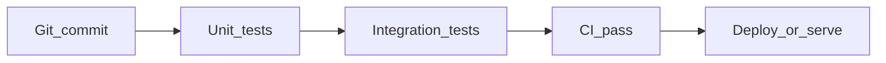

# Part E — Software testing for MLOps


| **Focus** | pytest + CupGuard pipeline tests |
| **Builds on** | Part-A/B CupGuard lifecycle and serving |

Part-A and Part-B train and serve the CupGuard outcome model. Part-C containerises inference. Part-D adds a Redis cache. Part-E adds **automated tests** — the stress test that catches broken features or loopholes before you deploy.

---

## Why testing matters in MLOps

Production ML fails quietly: a service can return HTTP 200 with wrong probabilities after a small preprocessing change. Tests turn assumptions into checks that run on every commit.

| Test type | What it guards | CupGuard example |
|-----------|----------------|------------------|
| **Unit** | Pure logic, fast feedback | `ingest()` outcome and flag derivation |
| **Integration** | Components wired correctly | `predict_fixture()` with the real pickle model |
| **Contract / schema** | Output shape stable for clients | Prediction keys and probabilities sum to 1 |
| **Data validation** | Upstream drift or bad rows | Feature columns match the `FEATURES` list |
| **Regression (CI gate)** | Metrics do not silently drop | `evaluate()` accuracy above a floor (stretch) |



In a mature MLOps pipeline, unit tests run in seconds on every push; integration tests run before staging deploy; metric regression gates block promotion when accuracy falls.

---

## Testing libraries

| Library | Role | Typical MLOps use |
|---------|------|-------------------|
| **pytest** | Test runner, fixtures, parametrize | Default choice for Python ML repos |
| **unittest** | Stdlib xUnit style | Legacy codebases, stdlib-only CI |
| **hypothesis** | Property-based testing | Fuzz feature builders, invariants |
| **great_expectations** | Data expectations | Schema and range checks on `match_features.csv` |
| **evidently / whylogs** | Drift and quality reports | Production monitoring (not unit tests) |

This lab uses **pytest** because assertions read like plain Python, `@pytest.mark.parametrize` avoids copy-paste, and CI integration is one command: `pytest -q`.

---

## Prerequisites

- Python 3.11 with the CupGuard environment from Part-A/B (pandas, scikit-learn)
- Trained model at `Part-B/cupguard/models/outcome_model.pkl`
- Processed data at `Part-B/cupguard/data/processed/team_stats_2025.csv`

If the model file is missing, train once from Part-B:

```bash
cd MLOps-Abha/Part-B
python -c "import sys; sys.path.insert(0, 'cupguard/src'); from pipeline import run_lifecycle; run_lifecycle()"
```

---

## Setup

From **Part-E**, with your CupGuard conda/uv environment active:

```bash
cd MLOps-Abha/Part-E
uv sync
uv run pytest -v
```

Part-E `pyproject.toml` adds only `pytest`. The CupGuard ML dependencies must already be installed from Part-A/B.

---

## Exercise: pytest on CupGuard

Open [`tests/test_cupguard.py`](tests/test_cupguard.py). The solution suite covers five patterns:

| Test | Type | What it checks |
|------|------|----------------|
| `test_ingest_adds_outcome_labels` | Unit | Synthetic 2-match CSV; `ingest()` labels outcomes and flags |
| `test_fixture_features_returns_expected_columns` | Contract | Brazil vs France row has 9 columns matching `FEATURES` |
| `test_predict_fixture_output_contract` | Integration | Real model returns 3 outcome keys; probs sum to 1 |
| `test_predict_fixture_parametrized` | Parametrize | Same contract for two different fixtures |
| `test_predict_fixture_raises_without_model` | Error path | `monkeypatch` missing pickle → `FileNotFoundError` |

The test file adds Part-B `cupguard/src` to `sys.path` at the top so it can import `pipeline` without editing Part-B.

### Expected output

```
tests/test_cupguard.py::test_ingest_adds_outcome_labels PASSED
tests/test_cupguard.py::test_fixture_features_returns_expected_columns PASSED
tests/test_cupguard.py::test_predict_fixture_output_contract PASSED
tests/test_cupguard.py::test_predict_fixture_parametrized[Brazil-France] PASSED
tests/test_cupguard.py::test_predict_fixture_parametrized[Argentina-Germany] PASSED
tests/test_cupguard.py::test_predict_fixture_raises_without_model PASSED
tests/test_cupguard.py::test_model_artifact_exists PASSED

======================== 7 passed in X.XXs ========================
```

### Exercises

1. Run `uv run pytest -v` and confirm all tests pass.
2. Red Team Exercise: Break all seven tests and ensure that they fail. Then design new tests for your evaluation conditions to make them pass.
3. Add a new `@pytest.mark.parametrize` case for `"Spain"` vs `"Italy"`.

---

## Stretch goals

- Add a GitHub Actions job that runs `pytest` on every pull request
---

## Project layout

```
Part-E/
├── README.md
├── pyproject.toml
└── tests/
    └── test_cupguard.py
```
