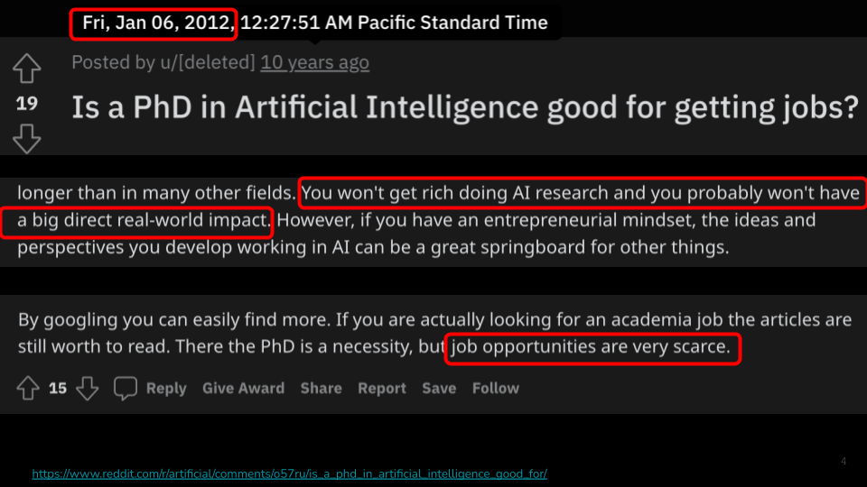
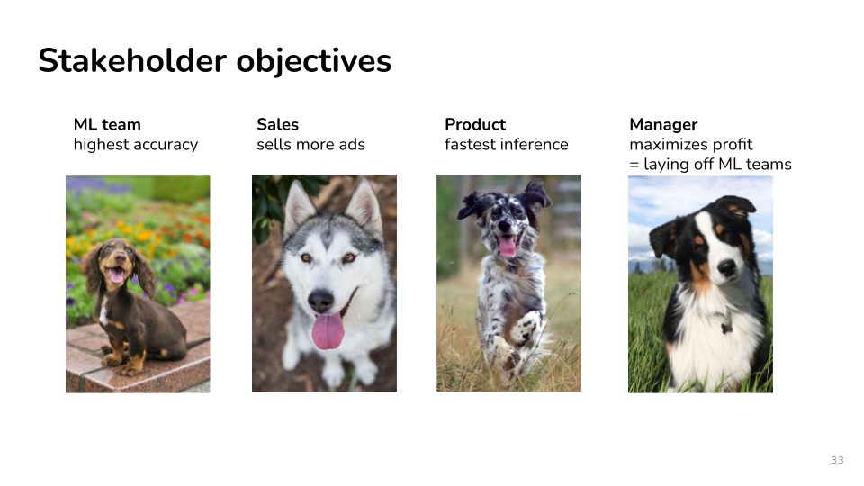

# MLOps Foundations

This section provides a brief introduction into the world of MLOps and production systems. It then introduces the **CupGuard** exercise — a pipeline to predict **2026 FIFA World Cup** match outcomes.

---

## Didn't Age Well



> *Caption: An excerpt from a 2012 Reddit post about careers in AI, including predictions about research, impact, and job opportunities – predictions that didn't exactly hold up over time!*

## What Is Different in ML?

- Machine learning components are part of larger systems
- Data scientists and software engineers have different goals and focuses
- Building systems requires both
- Software releases ship **logic**; ML releases ship **logic + learned parameters + data**.
- Testing must cover **data schemas**, **feature distributions**, and **model quality** — not only unit tests.
- Rollbacks may require reverting **datasets and feature pipelines**, not just container images.

---


## MLOps in Plain Language

- MLOps connects **data engineering**, **ML development**, and **production operations** into one workflow.
- It treats **datasets, features, experiments, models, and deployments** as versioned artifacts you can track and reuse.
- The goal is not more tooling for its own sake — it is **fewer surprises in production**.

---


## What Makes Production ML Hard?

- Research notebooks are built for **fast exploration**, not long-term maintainability.
- Production systems must handle **changing data**, **evolving code**, and **model decay** over time.
- A small preprocessing change can **silently break** a model that still returns a successful HTTP response.
- MLOps is the discipline of making ML **reliable**, **auditable**, and **repeatable** at scale.

---


## Research vs. Production Mindset

ML research vs. ML production

Source: CS329S (Stanford). See also "Utility is in the Eye of the User: A Critique of NLP Leaderboards" (Ethayarajh & Jurafsky, EMNLP 2020).

---


## Stakeholder objectives



Source: CS329S (Stanford).

---

## When Do You Need MLOps?

- One notebook and one model in a paper may not need a full platform.
- Once a **second person depends on your model** — or **users depend on uptime** — you do.
- Rule of thumb: if a bad deploy would affect **customers** or **compliance**, invest in MLOps.

---

## Common Production Surprises

- **Training–inference delta:** offline metrics look great, online metrics collapse.
- **Silent schema changes** upstream break features without crashing the service.
- The original author leaves and **nobody can reproduce** the winning experiment.

---


## Artifacts — DevOps vs. MLOps

- **DevOps** primary artifact: source code in Git.
- **MLOps** primary artifacts: code, datasets, features, experiments, models, and monitoring configs.


---


## Deployment — DevOps vs. MLOps

- **DevOps** deploys a service binary or container image.
- **MLOps** deploys a **model version** tied to a **feature pipeline version**s.

---


## The ML Lifecycle — Overview

- A typical lifecycle spans **problem definition → data → modeling → deployment → monitoring → retraining**.
- Each stage produces **artifacts** that later stages depend on; weak links compound quickly.

---


## Stage 1 — Problem Definition

- Start with a **business or scientific question**, not with a model architecture.
- Write down **who consumes the prediction** and **what decision it drives**.
- Define success before you touch data: what would **“good enough”** look like?

---


## Stage 2 — Feature Engineering

- Raw data arrives from **databases, streams, files, APIs**, and third-party vendors.

- Features transform raw inputs into **model-ready signals** at a defined point in time.

---


## Stage 3 — Training

- Training should be **scripted**, **parameterized**, and runnable by someone other than the author.
- Save **seeds**, **library versions**, and **data snapshots** needed to reproduce results.
- Log hyperparameters and metrics to a **central experiment tracker**, not scattered files.


---


## Stage 4 — Deployment (CI/CD)

### Git and Code Review (CI)

- Git tracks **training scripts**, **configs**, **tests**, and **infrastructure definitions**.
- Pull requests create a **review trail** required for audit and knowledge sharing.
- **CI should build the same environment** used in production training when possible.

---

### Docker and Kubernetes (CD)

- **Docker** packages code, runtime, and dependencies into an immutable image.
- **Kubernetes** schedules containers, scales them, and manages secrets in production.

- Use **virtual environments**, **conda env files**, or **Docker images** — not ad hoc `pip install` on each machine.


---

## Stage 5 — Monitoring

- Monitor **infrastructure health** and **model behaviour**.

- Track **model drift**, **latency**, and business KPIs.

---


## Stage 6 — Retraining

- Models age as **user behaviour**, **regulations**, and **upstream systems** change.
- **Archive old models** with metadata so past decisions remain explainable.

---

## Practical exercises

Open up **Lab 01** in [Part-A](./Part-A/). Install the setup and run the Steamlit agent as below:


```bash
cd MLOps-Abha/Part-A
uv pip install -r pyproject.toml
streamlit run cupguard/src/worldcup_agent_app.py
```

See [Part-A/README.md](./Part-A/README.md) for full setup instructions.

---


## References

CupGuard draws from the datasets below:


| Resource                                                                                                                                         | Description                                                                                                                                    |
| ------------------------------------------------------------------------------------------------------------------------------------------------ | ---------------------------------------------------------------------------------------------------------------------------------------------- |
| [Can Machine Learning Predict the World Cup?](https://towardsdatascience.com/can-machine-learning-predict-the-world-cup/)                        | Towards Data Science article by Marco Hening Tallarico — building an ML football forecaster for tournament outcomes.                           |
| [International-Football-Match-Forecasting-Pipeline](https://github.com/marco-hening-tallarico/International-Football-Match-Forecasting-Pipeline) | R-based sports analytics project: reproducible pipeline for collecting, validating, modeling, and visualizing international match predictions. |
| [martj42/international_results](https://github.com/martj42/international_results)                                                                | CC0 dataset of ~49k men's full international matches (1872–2024); CupGuard ingests `results.csv` from this repository.                         |
| [SEAI Lecture 1: Introduction to Software Engineering for AI](https://ckaestne.github.io/seai/S2021/slides/01_introduction/intro.html)           | Introductory slides covering reproducibility and software engineering best practices in AI and machine learning.                               |


